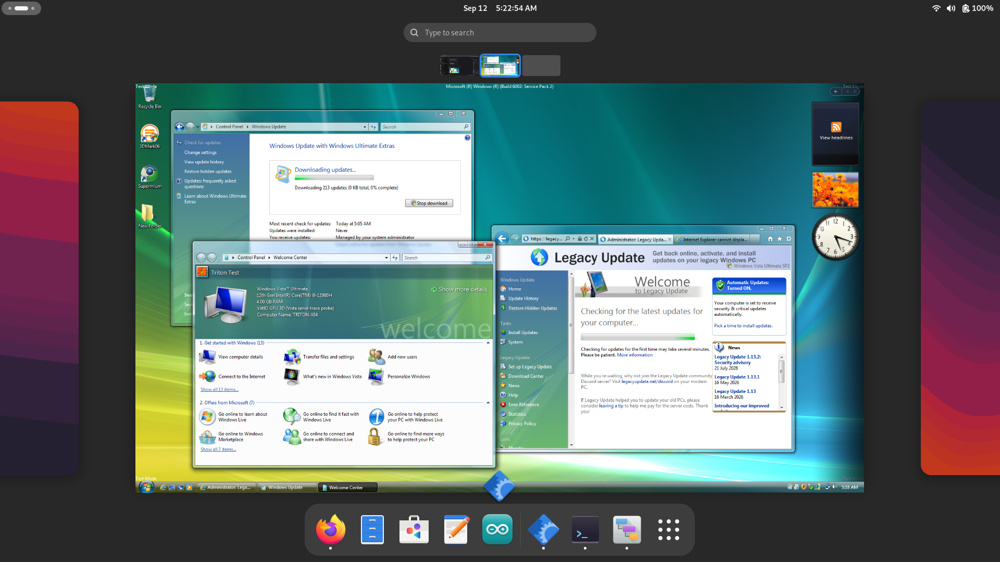
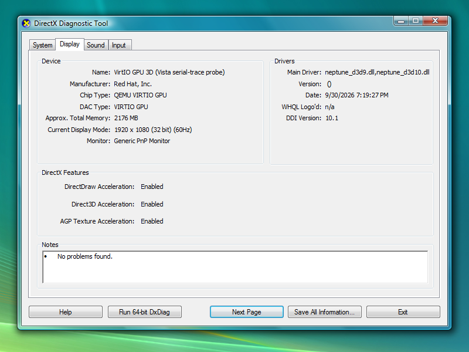
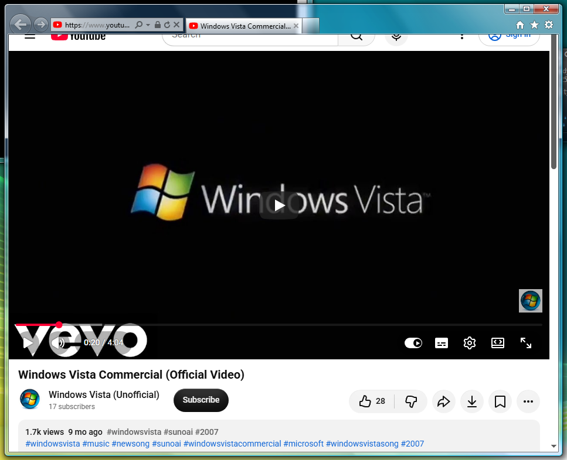
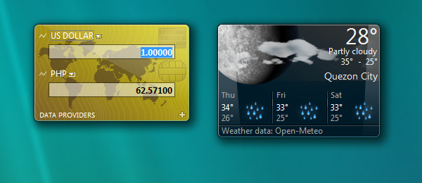

# Vista Renewed

Three projects for Windows Vista: Triton graphics, Internet Explorer and
Windows Sidebar.

## Triton graphics




Graphics drivers for Vista in QEMU, with Direct3D 9/10 and a Linux/Vulkan
backend. Compatibility and smooth display output are still in progress.

[Build guide](docs/BUILDING.md) · [Architecture](docs/ARCHITECTURE.md) ·
[Known limits](docs/STATUS.md)

## Internet Explorer

[](https://youtu.be/95Qvo38lhAI?si=KXsyEoenFpbjFgtT&t=20)

A prototype that connects IE and MSHTML to a modern browser engine, with
document adapters, tests and Supermium/CEF build scripts. The full CEF build
is unfinished. The screenshot shows YouTube paused at 0:20.

[Setup and status](docs/DESKTOP-MODULES.md)

## Windows Sidebar



New data providers for the original RSS, weather and currency gadgets.
The tools keep the original gadget pages and back up files before changes.

[Setup](docs/VISTA_SIDEBAR_GADGETS.md)

## Getting started

Clone without `--recurse-submodules`, then follow the guide for your project.
Build the shared toolchain image when the guide calls for it:

```sh
bash scripts/dev-container.sh build
```

You need your own Vista installation. Windows media, SDK/WDK files, VM disks
and private signing keys are not included.

See the [build checks](tests/README.md), [CI guide](docs/CI.md) and
[license notes](LICENSE.md).
