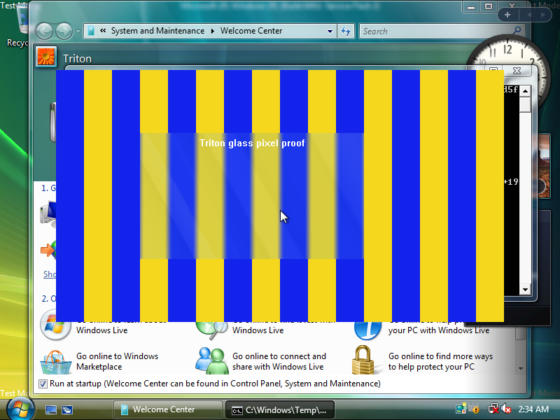

# Triton for Windows Vista

This project ports osy's Triton graphics driver to Windows Vista.
The port supports Windows Display Driver Model (WDDM) 1.0 and Direct3D 9 graphics interfaces.
QEMU runs the virtual machine (VM).
Neptune transfers graphics commands to the Linux host.
DXVK converts host graphics commands to Vulkan, a graphics programming interface.

Aero Glass transparency and blur work in the tested VM.
Desktop Window Manager (DWM), the Windows desktop compositor, supplies these effects.



This driver is experimental.
The verified guest uses Vista Ultimate Service Pack 2 (SP2) x64, checked build 6002.18005.
x64 identifies the 64-bit target.
x86 identifies the 32-bit target.
A checked build includes additional diagnostic checks.
The Linux host uses Intel Iris Xe graphics and Kernel-based Virtual Machine (KVM) acceleration.
The VM uses four virtual processors.
Both x64 and x86 drivers compile.
Tests do not establish x86 guest compatibility.
Boot and shutdown tests also produced blue screens.
See the [status and limits](docs/STATUS.md).

## Start here

- [Build and development setup](docs/BUILDING.md)
- [Continuous integration (CI) driver ISO build](docs/CI.md)
- [Architecture and source map](docs/ARCHITECTURE.md)
- [Verification and known limits](docs/STATUS.md)
- [Detailed Aero evidence](notes/AERO_GLASS_VERIFICATION.md)
- [Upstream sources and licenses](docs/UPSTREAM.md)

An ISO file contains a disc image.
CI builds produce an experimental installer ISO with a development signature.
Git contains source files, not a certified driver release.

Clone the repository without `--recurse-submodules`.
From the repository root, run this command:

```sh
python3 scripts/bootstrap_sources.py
```

The repository includes the local DXVK change as a Git bundle and a readable patch.
The bootstrap script restores the recorded commit, then downloads its dependencies.
Ordinary recursive submodule initialization cannot download this local commit from osy's upstream repository.

## Driver changes

The port adds a Vista kernel display driver and a Direct3D 9 user-mode driver.
The user-mode driver handles shader translation, resource sharing, synchronization and presentation.
Host changes transfer these operations through Neptune to the Linux renderer.
A graphics probe and pixel measurements check the output.
A probe is a test program that records observed behavior.

The shader converter initially mapped all eight DWM texture-coordinate inputs to TEXCOORD0.
This error prevented Glass blur.
The identity mapping restored eight distinct texture samples.
The regression test checks the average of eight different gray texture pixels.
The desktop test checks background transmission and softened edges.

## Repository layout

The `triton-*` directories retain upstream layouts and license files.
The `scripts/` directory contains build and deployment tools.
The `test-artifacts/` directory contains deployment service and probe support source files.
Existing builds use these paths.
The `notes/` and `handoff/` directories contain investigation and transfer records.

Git excludes VM disks, Windows installation media, downloaded development kits, signing identities and generated packages.
Supply your own Vista guest.
