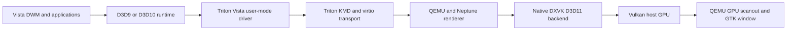

# Graphics architecture

Triton implements Vista WDDM 1.0 kernel and user-mode interfaces. Neptune
transports guest Direct3D work through virtio to a host renderer. On Linux,
native DXVK translates host Direct3D 11 operations to Vulkan. QEMU presents
rendered output through its GPU scanout and GTK/OpenGL display path.

The D3D11 frontend shares transport and backend code. The Linux build uses DXVK.

| Source | Responsibility |
| --- | --- |
| `triton-kmd/viogpu/viogpu3d/` | WDDM allocation, paging, presentation and device lifecycle |
| `triton-umd/src/virtio/neptune/vista-d3d9/` | D3D9 frontend and shader conversion |
| `triton-umd/src/virtio/neptune/vista-d3d10/` | Vista D3D10 runtime frontend |
| `triton-umd/src/virtio/neptune/triton/` | Shared D3D implementation and D3D11 frontend |
| `triton-umd/src/virtio/neptune/` | Guest resource sharing and transport |
| `triton-virglrenderer/src/neptune/` | Host command dispatch, resources and backend loading |
| `triton-virglrenderer/server/`, `src/proxy/` | Renderer process/proxy exchange |
| `triton-qemu/hw/display/`, `ui/` | Device, display ownership, reset and presentation |
| `triton-dxvk/` | Native host graphics execution and exported sharing interfaces |
| `packaging/` | Installer service, INF and Windows resources |

## Matching components

Guest and host Neptune must both use wire revision 4.
This includes color-copy, shared-export cancellation and map-abort semantics.
Update both copies of the protocol headers when changing the wire format.
The generator mentioned in their comments is unavailable in this repo.

The renderer's version-1 exported resource layout is a separate server/proxy
contract. Keep the server, proxy, library and QEMU consumers matched. DXVK's
single-plane sharing flag and native color-copy/dithering interfaces likewise
require their corresponding guest and host consumers. Build and deploy the guest drivers, QEMU, renderer and backend together.

## Presentation and CPU access

Submission, GPU completion, scanout publication and visible GTK-window changes
are separate events. GPU-owned scanout avoids an ordinary CPU screenshot surface
as the presentation source; explicit screenshots have their own readback path.
External-only EGL images use a GPU copy helper before desktop OpenGL consumption.
Lifetime and reset handling must retire imports before deleting their storage.

Applications still use CPU access and readback paths. Primary CPU and GPU
storage can use separate allocations.

Use tracing to inspect resource and display events. See
[current display limits](STATUS.md) for performance status.
