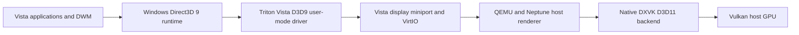

# Architecture

The driver implements Vista's interfaces while reusing Triton's Neptune
transport and host rendering infrastructure. The Linux path is the verified
configuration here; the retained DXMT/Metal sources belong to the earlier
macOS development route.

| Directory | Role |
| --- | --- |
| `triton-kmd/viogpu/viogpu3d` | Vista display miniport |
| `triton-umd/src/virtio/neptune/vista-d3d9` | D3D9 driver, shader converter integration, public runtime probe |
| `triton-umd/src/virtio/neptune` | Guest transport and shared resources |
| `triton-qemu/hw/display` | Virtual GPU and host presentation |
| `triton-virglrenderer/src/neptune` | Host command dispatch |
| `triton-dxvk` | Native D3D11/Vulkan backend |
| `triton-dxmt`, `triton-angle`, `triton-libepoxy` | Retained macOS route and graphics dependencies |
| `scripts` | Build, deployment, inspection and verification tools |
| `test-artifacts/vista-driver-deploy-service.c` | Guest-owned deployment and proof reboot service |

Changes to resource ownership, fences, shader state and presentation are
described in the historical `notes/` reports. Their intermediate results should
not be read as the current support matrix.
