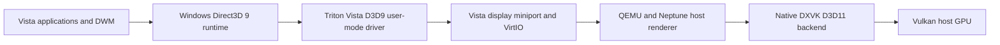

# Architecture

Triton implements the Windows Vista graphics driver interfaces.
Neptune transfers graphics commands between the guest and host.
QEMU runs the virtual machine.
DXVK converts host Direct3D 11 commands to Vulkan graphics operations.

Desktop Window Manager (DWM) composes the Windows desktop.
Direct3D 9 (D3D9) supplies the graphics interface that DWM uses on Vista.
A graphics processing unit (GPU) executes host graphics operations.
VirtIO supplies the virtual device interface.

Tests verify the Linux host configuration.
The repository also retains DXMT and Metal source files from earlier macOS development.
DXMT converts Direct3D commands to Metal, the macOS graphics interface.

| Directory | Role |
| --- | --- |
| `triton-kmd/viogpu/viogpu3d` | Vista display miniport |
| `triton-umd/src/virtio/neptune/vista-d3d9` | D3D9 driver, shader converter integration, public runtime probe |
| `triton-umd/src/virtio/neptune` | Guest transport and shared resources |
| `triton-qemu/hw/display` | Virtual GPU and host presentation |
| `triton-virglrenderer/src/neptune` | Host command dispatch |
| `triton-dxvk` | Native D3D11/Vulkan backend |
| `triton-dxmt`, `triton-angle`, `triton-libepoxy` | Retained macOS route and graphics dependencies |
| `scripts` | Build, deployment, inspection and verification tools |
| `test-artifacts/vista-driver-deploy-service.c` | Guest-owned deployment and proof reboot service |

Historical `notes/` reports describe changes to resource ownership, fences, shader state and presentation.
A fence marks completion of graphics work.
Use [the current status](STATUS.md) for the supported test configuration.
Do not treat intermediate test results as current support claims.
