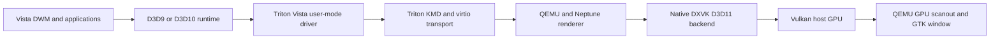

# Architecture and component contracts

Triton implements Vista WDDM 1.0 kernel and user-mode interfaces. Neptune
transports guest Direct3D work through virtio to a host renderer. On Linux,
native DXVK translates host Direct3D 11 operations to Vulkan. QEMU presents
rendered output through its GPU scanout and GTK/OpenGL display path.

The retained D3D11 frontend shares transport/backend code. DXMT and Metal source
remain for upstream context; the Linux workflow does not validate the macOS path.

| Source | Responsibility |
| --- | --- |
| `triton-kmd/viogpu/viogpu3d/` | WDDM allocation, paging, presentation and device lifecycle |
| `triton-umd/src/virtio/neptune/vista-d3d9/` | D3D9 frontend and shader conversion |
| `triton-umd/src/virtio/neptune/vista-d3d10/` | Vista D3D10 runtime frontend |
| `triton-umd/src/virtio/neptune/triton/` | Shared D3D implementation and D3D11 frontend |
| `triton-umd/src/virtio/neptune/` | Guest resource sharing and transport |
| `triton-virglrenderer/src/neptune/` | Host command dispatch, resources and backend loading |
| `triton-virglrenderer/server/`, `src/proxy/` | Renderer process/proxy exchange |
| `triton-qemu/hw/display/`, `ui/` | Device, display ownership, reset and presentation |
| `triton-dxvk/` | Native host graphics execution and exported sharing interfaces |
| `packaging/` | Installer service, INF and Windows resources |

## Deploy paired components

Guest Neptune and host Neptune must use downstream wire revision **4** together.
This includes color-copy, shared-export cancellation and map-abort semantics.
The duplicated protocol headers are maintained together; the upstream generator
mentioned in their comments is not included here. Review both copies when
changing the protocol.

The renderer's version-1 exported resource layout is a separate server/proxy
contract. Keep the server, proxy, library and QEMU consumers matched. DXVK's
single-plane sharing flag and native color-copy/dithering interfaces likewise
require their corresponding guest and host consumers. Installing a new UMD over
an unrelated QEMU/renderer/backend is not a supported configuration.

## Presentation and CPU access

Submission, GPU completion, scanout publication and visible GTK-window changes
are separate events. GPU-owned scanout avoids an ordinary CPU screenshot surface
as the presentation source; explicit screenshots have their own readback path.
External-only EGL images use a GPU copy helper before desktop OpenGL consumption.
Lifetime and reset handling must retire imports before deleting their storage.

This does not establish a completely GPU-only driver. Application-requested CPU
access, staging/readback and older primary backing paths remain. Shared primary
CPU storage and GPU storage are not proven to be one permanently coherent
allocation. The experimental direct-primary allocation and synthetic Vulkan
provenance diagnostics are excluded from the public production path.

Tracing helps explain resource and display events. It does not prove smooth
output in QEMU. See [current display limits](STATUS.md).
